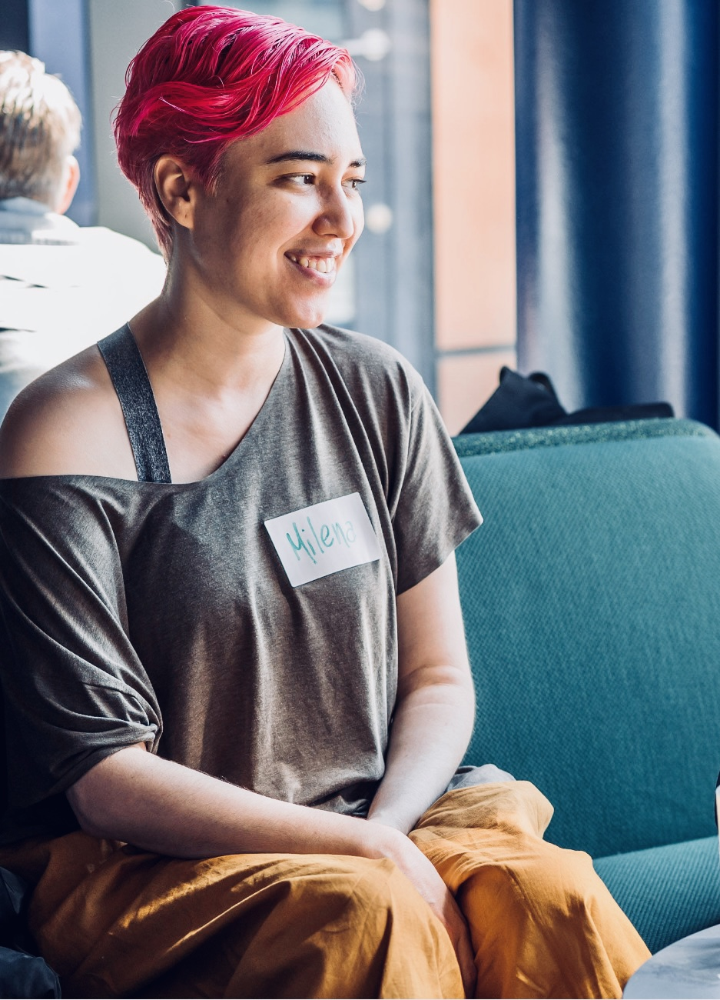
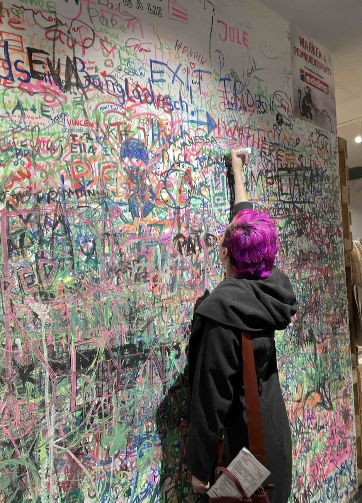

## About Mih

Hi! My name is Milena. I’m Brazilian by birth and Swedish by choice. 

I’ve been playing with web development since I was a teenager - FrontPage anyone? - and I cannot have enough of it, many (or not so many) years later. I genuinely believe that the future of technology resides on the web or a future version of it.

That love for the web landed me a job at Spotify, where I spent 6 years improving both their web products and myself. It was great working with such big products as their Web Player, having the freedom to be both leading and lead on impactful features and also working together with one or more teams to make sure the user has the best experience possible.

Other technical interests of mine are online communities, which made me dedicate my entire master’s to studying CSCW and writing a thesis entitled “Diferenças comportamentais entre gêneros em comunidades de perguntas e respostas.” (“Behavioural differences in between people of different genders in Q&A online communities”). And data. Both my master’s and working at Spotify taught me the importance of data, data-informed decisions, experimentations like A/B testing, and so on. 

My goal is to bring those learnings with me wherever I go and help products grow. Whether on leading a team to success.

Finally, I do have a few hobbies! Feel free to talk to me about mechanical keyboards, photography, and stationery. Very different ways to tell stories :)

    

    

---

[Color Palette](https://coolors.co/palette/22223b-4a4e69-9a8c98-c9ada7-f2e9e4), [Fonts](https://fonts.adobe.com/fonts)

    

    

    

    

    

